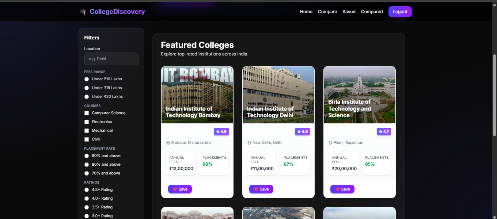
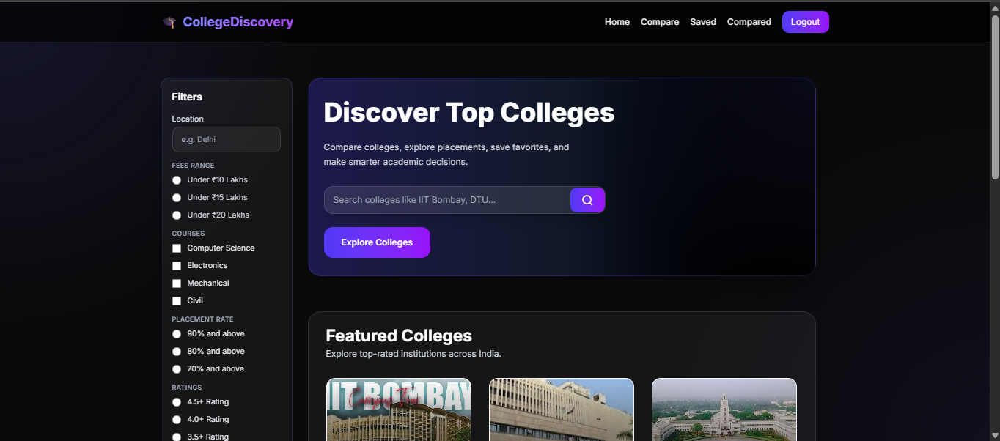
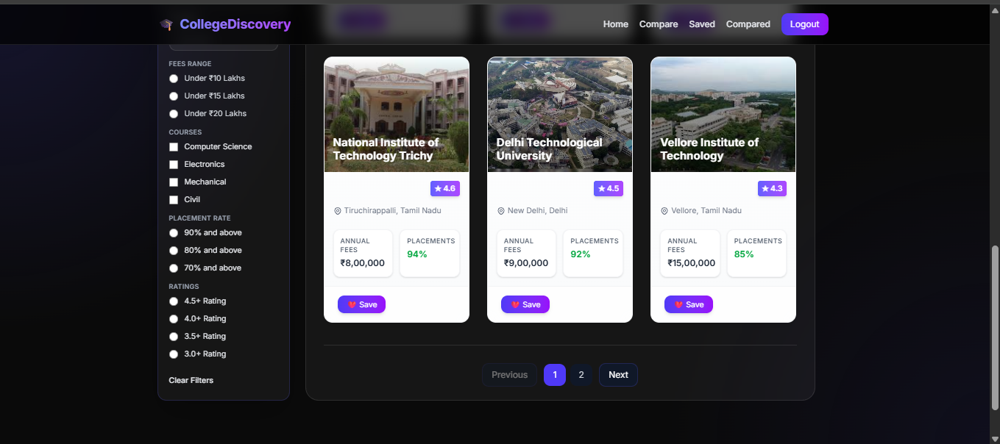
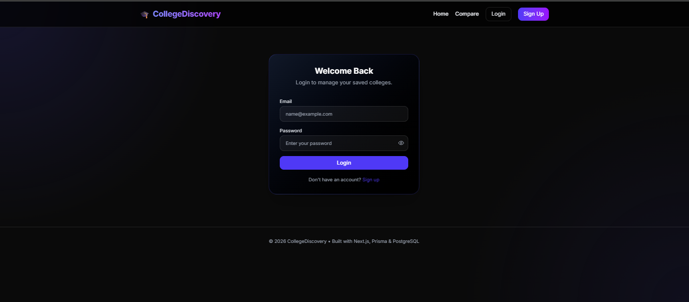
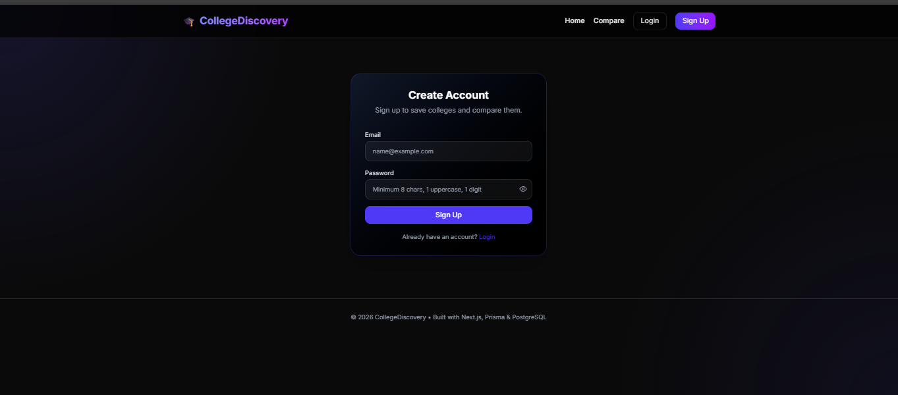
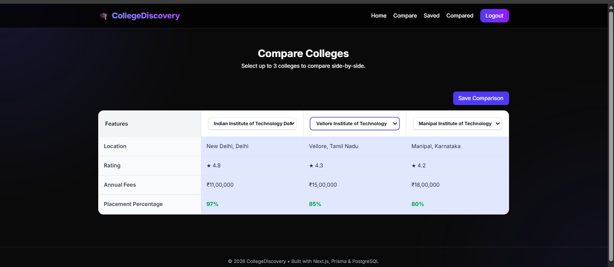
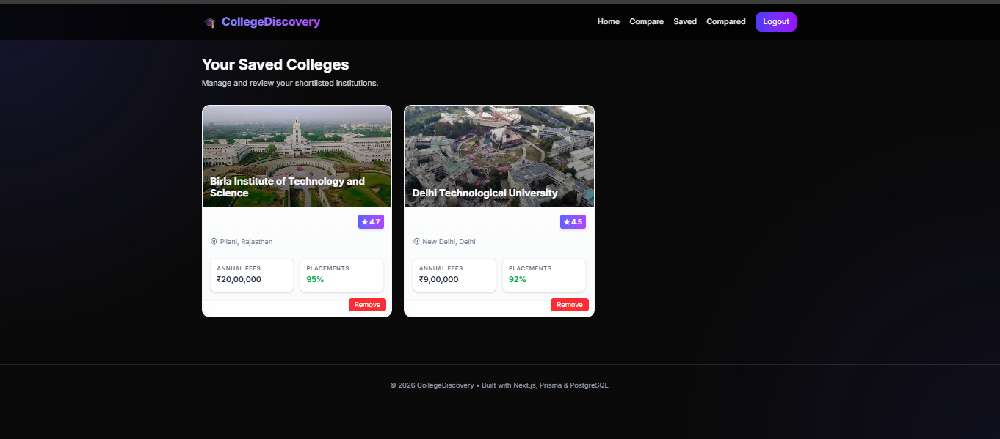
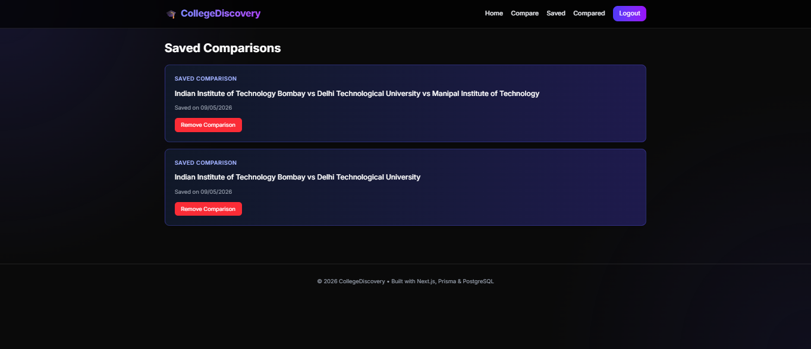
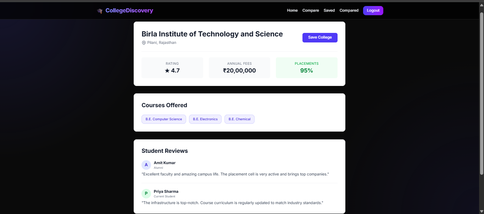

# CollegeDiscovery 🎓

A full-stack college discovery and comparison platform where users can explore colleges, compare institutions, save favorites, and view detailed college information.

---

## 🚀 Live Demo

Frontend: https://college-platform-lovat.vercel.app/

Backend API: https://college-platform-dv5r.onrender.com

---

## ✨ Features

- 🔍 Search colleges
- 🎯 Filter by location, fees, ratings, courses, and placements
- ❤️ Save favorite colleges
- ⚖️ Compare colleges
- 🔐 JWT Authentication
- 📄 College details page
- 📱 Responsive UI
- ☁️ Fully deployed full-stack application

---

## 🛠️ Tech Stack

### Frontend
- Next.js
- TypeScript
- Tailwind CSS
- Framer Motion

### Backend
- Express.js
- Node.js
- Prisma ORM
- PostgreSQL
- JWT Authentication

### Deployment
- Vercel (Frontend)
- Render (Backend)
- Neon PostgreSQL (Database)

---

## 📸 Screenshots

### 🏠 Homepage



### 🏠 Homepage (Logged In)



### 🎯 Homepage with Filters



### 🔐 Login Page



### 📝 Signup Page



### ⚖️ Compare Colleges



### ❤️ Saved Colleges



### 📊 Saved Comparisons



### 📄 College Details




---

## ⚙️ Installation

### Clone the repository

```bash
git clone https://github.com/Juhi-Dubey/College-Platform
```

### Frontend Setup

```bash
cd frontend
npm install
npm run dev
```

### Backend Setup

```bash
cd backend
npm install
npm run dev
```

---

## 🔑 Environment Variables

### Frontend (.env.local)

```env
NEXT_PUBLIC_API_URL=your_backend_api_url
```

### Backend (.env)

```env
DATABASE_URL=your_database_url
JWT_SECRET=your_jwt_secret
```

---

## 📚 What I Learned

- Full-stack architecture
- API integration
- Authentication using JWT
- Database management with Prisma
- Deployment using Vercel and Render
- Responsive UI design
- State management and filtering logic

---

## 🚀 Future Improvements

- Forgot password functionality
- Advanced college recommendations
- Admin dashboard
- Better analytics and charts

---

## 👨‍💻 Author

Developed by Juhi Dubey ✨  
Aspiring full-stack developer focused on building scalable and user-friendly web applications.
